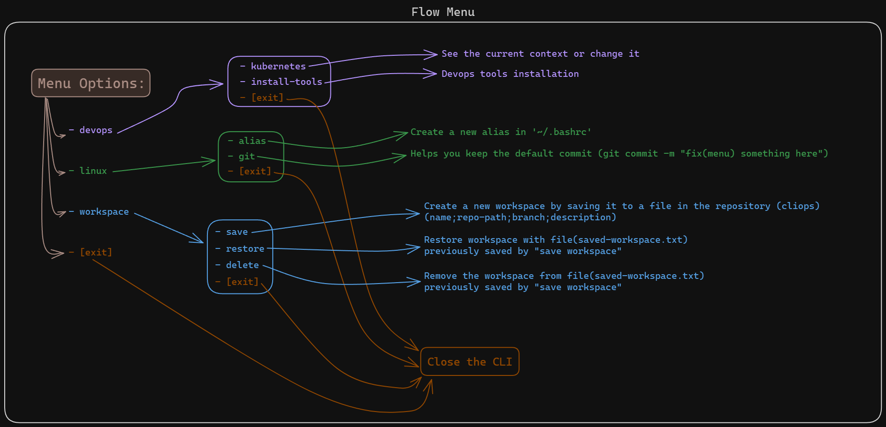
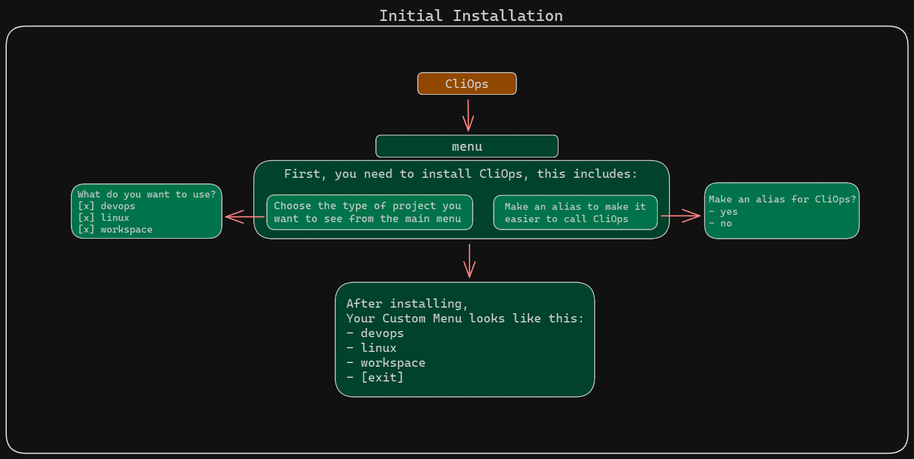

# CliOps - Made with 'Shell' and 'Charm Gum'

> ### This is a CLI to help you automate some stuff


## Prerequisites
- Have installed 'Charm Gum'
  - [Official Installation Charm Gum](https://github.com/charmbracelet/gum#installation)
    ```sh
    # Debian/Ubuntu
    sudo mkdir -p /etc/apt/keyrings
    curl -fsSL https://repo.charm.sh/apt/gpg.key | sudo gpg --dearmor -o /etc/apt/keyrings/charm.gpg
    echo "deb [signed-by=/etc/apt/keyrings/charm.gpg] https://repo.charm.sh/apt/ * *" | sudo tee /etc/apt/sources.list.d/charm.list
    sudo apt update && sudo apt install gum
    ```
    ```sh
    # gum version v0.11.0
    gum --version 
    ```

<br>
<br>

## CliOps Installation:

### Running the main file
- You have two choices:
  - You can make an alias:
    ```sh
    #### Adding the 'alias'
    echo "alias cliops='/home/my-user/repositories/cliops/main.sh'" >> ~/.bashrc
    #### Compiling the 'bashrc'
    source ~/.bashrc
    ```
    ```sh
    #### Running in terminal
    cliops
    ```
  - You can run the main file (main.sh) of the project:
    ```sh
    cd /home/my-user/repositories/cliops/
    bash main.sh
    ```

<br>
<br>

## CliOps Flow:



<br>
<br>

## CliOps TO-DO:
- Make the CliOps have more dynamic settings for each type of use/user and have him create his own alias
    

<br>
<br>

## References:
- [Official Tutorial](https://github.com/charmbracelet/gum#tutorial)
- [A gist of Viktor Farcic](https://gist.github.com/vfarcic/02bbfaf6cf8f5b03f4267b50f3f3233b)
- [A video of Viktor Farcic](https://www.youtube.com/watch?v=U8zCHA-9VLA&list=PLvMMe7JboDahZp2xNRpjv_5XBIOVSlmtI)
- [An example of Maas Lalani](https://github.com/charmbracelet/gum/blob/main/examples/demo.sh)
- [An article of trendoceans](https://trendoceans.com/gum-tool-linux/)
- [An article of tech.aufomm.com](https://tech.aufomm.com/how-do-i-use-charmbracelet-gum-to-improve-my-scripts/)
- [An article about Key Value of linuxhint.com](https://linuxhint.com/use-key-value-dictionary-bash/)
- [bash key-value by Dan Nanni (xmodulo.com)](https://www.xmodulo.com/key-value-dictionary-bash.html)
- [thanks @mvds (stackoverflow)](https://stackoverflow.com/questions/5584509/search-a-string-in-a-file-and-delete-it-from-this-file-by-shell-script)


